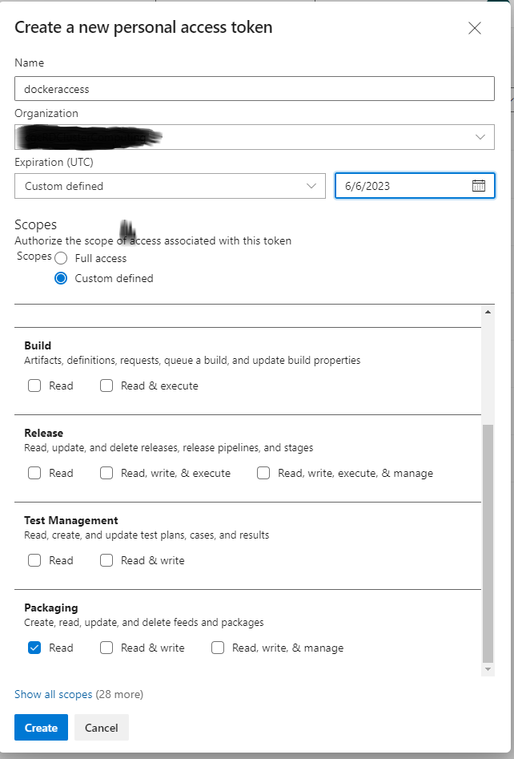

# Base Docker for python

## How to use this docker base template

### Getting Started

A personal access token needs to be [generated](https://docs.microsoft.com/en-us/azure/devops/organizations/accounts/use-personal-access-tokens-to-authenticate?view=azure-devops&tabs=Windows#create-a-pat) and stored in a file "azuredevopspat" inside the ".devcontainer" folder.  
)  
The initial build needs build using docker commands because vs-code doesn't have docker build secrets [VScode Secret Status](https://github.com/microsoft/vscode-remote-release/issues/4841):

Two Options can achieve this:
* Run on terminal 
  ```
  docker build --progress=plain --secret id=azdevopstoken,src=.devcontainer/azuredevopspat .devcontainer/

* Run using buildhelper.sh - The same thing but in a shell script.

After this it can be opened in vscode to reopen and attach, rebuild and attach etc. Some help if you need it.
1. [VS code install](https://code.visualstudio.com/docs/remote/containers#_installation)
2. [VS code Remote developement extension](https://code.visualstudio.com/docs/remote/containers-tutorial#_install-the-extension)

### Requirements Files
There are three requirments files to break up the different layers of the docker image. The purpose is so that the lower levels don't need to be built everytime and the build update process is quicker for the user:
* requirements-private.txt: contains the packages that need to be used and are installed from the private package artifacts server
  * azuredevopspat: a text file created by the user and a personal access token from azure devops is placed in to make allow the connection to the private repo
  * This file is in .devcontainer folder
  * command line build is required as described in "Getting Started" above
* requirements-dev.txt: this is requirements that support the application devoplment but are not required to run the code or application
* requirements.txt: these are the requirments that are needed to run the application these are also typically repeated in the setup.py files if you are making a package but typically work is easier if they are already installed. It can be good to make sure that what is requirement for a co-worker to run the code is contained in this file. 

### devcontainer.json
 This part of the file never is tracked in docker as it is typically just used for developement only. Extensions you would like to use in the container and that you would like to be available to other team can be added to this file.
 *  
 * [add extensions](https://code.visualstudio.com/docs/remote/containers#_adding-an-extension-to-devcontainerjson)
## Docker Resource Links

* Docker in VS code:
  * <https://github.com/microsoft/vscode-dev-containers>
  * Common scripts:
        * <https://github.com/microsoft/vscode-dev-containers/tree/main/script-library>
    * Python Base Image Use to Customize:
      * <https://github.com/microsoft/vscode-dev-containers/tree/main/containers/python-3>
* Docker Python Blog Series:
  * <https://www.docker.com/blog/tag/python-env-series/>
* Docker BuildKit for Private Repo:  
  * <https://forums.docker.com/t/docker-using-docker-buildkit-to-pass-a-token-secret-during-build-time/104151/3>
  * <https://docs.docker.com/develop/develop-images/build_enhancements/#new-docker-build-secret-information>
